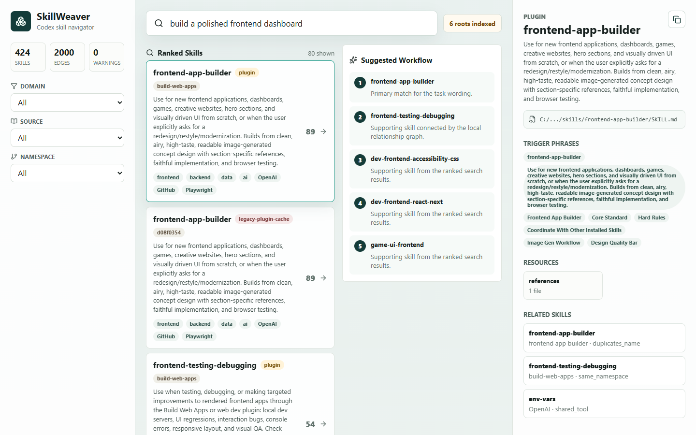
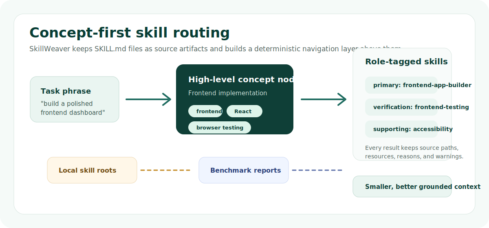
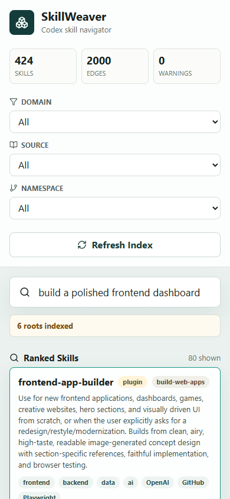

# SkillWeaver


SkillWeaver is a local-first navigator for Codex skills. It scans your local
`SKILL.md` files, builds a concept graph above them, and helps an agent choose
the right skill before it spends context on the wrong instructions.



## Why It Exists

Models have a real skill-navigation problem once a useful skill library gets
large:

- The full catalog can be too large to keep in context.
- Skill names overlap across user, system, and plugin libraries.
- The best skill is often implied by the task, not named by the user.
- Loading every plausible skill wastes tokens and can mix incompatible guidance.
- Local skill libraries change faster than generic hosted documentation.

SkillWeaver solves the local routing layer. It does not make a model "OP"; it
gives the model a smaller, better grounded set of instructions to inspect.

## What You Get

- **Concept-first navigation**: high-level work nodes such as frontend
  implementation, security review, GitHub collaboration, data dashboards, and
  deployment.
- **Role-tagged skills**: each concept points to gateway, primary,
  verification, supporting, and reference skills.
- **Ranked task routing**: search by plain task wording and get the likely
  skill path, not just keyword matches.
- **Suggested workflows**: primary plus supporting skills in a compact sequence.
- **Source provenance**: every recommendation keeps the absolute `SKILL.md`
  path and resource folders.
- **Local-first setup**: no account, no hosted service, no LLM call required to
  index or search.
- **Benchmark ledger**: active, holdout, clean regression, and nightmare
  routing suites are checked into `docs/`.

## Concept Map



SkillWeaver keeps the filesystem authoritative. It does not rewrite existing
skills. The concept layer is derived from scanner metadata and curated routing
rules, then exposed through the UI and API.

## Quick Start

```powershell
npm install
npm run dev
```

Open the app at `http://127.0.0.1:5177`.

The API runs at `http://127.0.0.1:3777`.

## Configure Your Skill Library

By default, SkillWeaver scans common Codex and agent skill folders under your
home directory:

- `$HOME\.codex\skills`
- `$HOME\.codex\skills\.system`
- `$HOME\.agents\skills`
- `$HOME\.codex\plugins\cache\openai-bundled`
- `$HOME\.codex\plugins\cache\openai-curated`
- `$HOME\.codex\plugins\cache\openai-curated-remote`
- `$HOME\.codex\plugins\cache\openai-primary-runtime`

For a fresh clone on another machine, copy `.env.example` to `.env.local` and
set semicolon-separated roots:

```powershell
$env:SKILLWEAVER_SKILL_ROOTS="$HOME\.codex\skills;C:\path\to\your\skills"
npm run dev
```

Keep machine-local paths in `.env.local`. Do not commit personal skill-library
roots into benchmark cases or source files.

## Screenshots

| Desktop navigator | Mobile layout |
| --- | --- |
|  |  |

## Benchmarked Results

These are deterministic routing benchmarks over the current local corpus used
when the reports were generated. Local skill counts can differ by machine and
configured roots.

| Suite | Cases | No SkillWeaver | Skill-level route | V2 concept route | What it means |
| --- | ---: | ---: | ---: | ---: | --- |
| [Active acceptance](docs/SKILL-USE-GAINS.md) | 78 | 74.4 | 76.4 | 99.5 | Main current-quality claim; 78/78 primary hit@1. |
| [Clean holdout V5 regression](docs/SKILL-USE-CLEAN-HOLDOUT-V5.md) | 17 | 59.3 | 55.1 | 95.3 | Regression evidence after V5 misses informed fixes, not clean generalization proof. |
| [Nightmare benchmark](docs/SKILL-ROUTING-NIGHTMARE.md) | 70 | 45.7 | 50.5 | 66.6 | Adversarial ambiguity and guardrail stress test; useful backlog signal. |

The active suite shows the concept route improving the composite output-quality
score by `+25.1` points versus no SkillWeaver and `+23.1` points versus the
skill-level route. The nightmare suite is intentionally harsh and still leaves
known failure modes to improve.

## Commands

| Command | Purpose |
| --- | --- |
| `npm run dev` | Start API and Vite UI together. |
| `npm run index:skills` | Scan configured roots and print corpus stats. |
| `npm test` | Run parser, API, routing, and nightmare-case unit coverage. |
| `npm run build` | Build the production UI. |
| `npm start` | Serve the API and production build. |
| `npm run benchmark:skills` | Regenerate the active acceptance report. |
| `npm run benchmark:skills:check` | Verify the active report is fresh. |
| `npm run benchmark:skills:nightmare` | Run the adversarial nightmare suite. |

More benchmark commands are documented in [Verification](docs/VERIFICATION.md).

## API Snapshot

SkillWeaver exposes a small local JSON API:

- `GET /api/health`
- `POST /api/refresh`
- `GET /api/skills?q=...`
- `GET /api/skills/:id`
- `GET /api/skills/:id/related`
- `GET /api/concepts?q=...`
- `GET /api/concepts/:id`
- `GET /api/concepts/:id/related`
- `GET /api/workflow?q=...`

Use `?mode=skills` on `/api/skills` or `/api/workflow` to compare against the
raw skill-level baseline. See [API Reference](docs/API.md).

## Repository Map

| Path | What lives there |
| --- | --- |
| `server/skill-scanner.js` | Scanner, parser, relationship builder, concept search, and routing logic. |
| `server/concept-routing-config.js` | Curated concept definitions and intent boosts. |
| `server/index.js` | Express API and production static server. |
| `src/` | React navigator UI. |
| `scripts/` | Indexing, dev server, and benchmark runners. |
| `benchmarks/` | Prompt suites and latest generated results. |
| `docs/` | Architecture, verification, benchmark reports, roadmap, and methodology. |
| `tests/` and `test/` | Node test coverage. |

## Read Next

- [Getting Started](docs/GETTING-STARTED.md)
- [Architecture](docs/ARCHITECTURE.md)
- [API Reference](docs/API.md)
- [Verification](docs/VERIFICATION.md)
- [Routing Evaluation Methodology](docs/ROUTING-EVAL-METHODOLOGY.md)
- [Concept Map Governance](docs/CONCEPT-MAP-GOVERNANCE.md)
- [Support Quality Roadmap](docs/SUPPORT-QUALITY-ROADMAP.md)

## Status

SkillWeaver is an experimental local tool. The concept route is already useful
on the checked-in benchmark suites, but it is not a universal planner and the
nightmare benchmark still exposes hard ambiguity cases. Treat results as
evidence, not magic.

Before publishing publicly, add the license you want the project to use.
