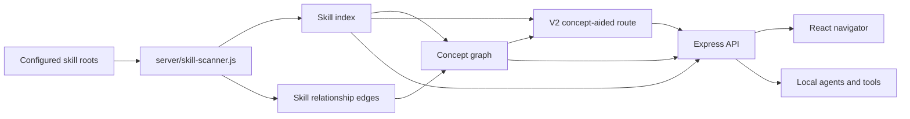

# Architecture

SkillWeaver is a local-first scanner, graph builder, and navigator for Codex
skills. It turns local `SKILL.md` files into two useful maps:

- a skill-level map of parsed metadata and relationship edges,
- a concept-level map that groups skills by high-level work.

The filesystem remains authoritative. SkillWeaver derives navigation metadata
without mutating source skills.

## Design Principles

- **Local first**: no hosted account, cloud sync, or LLM call is required.
- **Filesystem provenance**: every recommendation keeps the source `SKILL.md`
  path.
- **Deterministic by default**: the same roots and files produce the same index.
- **Concepts above skills**: high-level work concepts are primary navigation
  nodes; skills remain referenced source artifacts.
- **Honest evaluation**: benchmark reports separate acceptance, regression,
  holdout, and adversarial evidence.

## Runtime Components

| Component | Responsibility |
| --- | --- |
| `server/skill-scanner.js` | Discovers `SKILL.md` files, parses frontmatter/body text, infers tags, builds edges, creates concepts, and ranks results. |
| `server/concept-routing-config.js` | Curated concept definitions, explicit skill roles, adjacency, and intent boosts. |
| `server/index.js` | Express API, CORS policy, refresh endpoint, and production static serving. |
| `src/` | React UI for search, filters, concept browsing, skill inspection, related items, and workflow recommendations. |
| `scripts/` | Developer entrypoints for indexing, dev server orchestration, and benchmark generation. |
| `benchmarks/` | Prompt suites and latest generated benchmark artifacts. |
| `docs/` | Architecture, verification, methodology, benchmark reports, and roadmap material. |

## Data Flow

1. Roots are read from `SKILLWEAVER_SKILL_ROOTS` or default home-directory
   Codex paths.
2. The scanner walks those roots and finds `SKILL.md` files.
3. Each skill is parsed into name, description, body, source type, namespace,
   domains, triggers, tools, resources, and warnings.
4. Skill-level relationship edges are built from shared namespace, shared
   domain, shared tool, mentions, and other evidence.
5. Concept rules assign skills to high-level work nodes with role tags.
6. Concept edges are generated from curated adjacency and shared evidence.
7. API routes expose skills, concepts, details, related nodes, and workflows.
8. The React UI queries the API and lets the user navigate from task wording to
   concept to source paths.

## Concept Layer

Concept nodes represent high-level work such as frontend implementation, data
dashboards, security review, GitHub collaboration, deployment, and document
automation.

Each concept stores role-tagged skill references:

- `gateway`: load or inspect first.
- `primary`: main execution skill for the concept.
- `verification`: proof or QA skill.
- `supporting`: adjacent helper.
- `reference`: weaker but relevant evidence match.

This shape mirrors the useful part of MindWeaver's knowledge graph idea:
interconnected concepts with source-grounded references. It omits MindWeaver's
browser extension, content ingestion queue, quiz loop, and session learning
model because SkillWeaver's job is narrower.

## Routing Modes

SkillWeaver exposes two comparable routing modes.

| Mode | Used by | Behavior |
| --- | --- | --- |
| Skill-level baseline | `?mode=skills` | Ranks raw skills from names, descriptions, triggers, body text, resources, and skill edges. |
| V2 concept route | default | Uses skill ranking as an anchor, scores concept nodes, reranks role-tagged skills inside matching concepts, then appends skill-level fallback results. |

The default product route is V2 because it gives the model a concept-aware
candidate set while preserving fallback behavior when a task directly names a
skill or platform.

## API Surface

The local API provides:

- health and refresh endpoints,
- skill search and skill detail,
- related skill edges,
- concept search and concept detail,
- related concept edges,
- recommended workflow generation.

See [API Reference](API.md) for route details.

## Security And Privacy

SkillWeaver is built for local use. It can expose absolute paths in API
responses because provenance is a core debugging feature. Do not expose the API
to an untrusted network without adding authentication and path redaction.

The scanner reads local skill files and adjacent metadata only. It does not
rewrite skills, upload corpus data, or call an LLM.

## Evaluation

Routing quality is tracked through checked-in benchmark reports:

- active acceptance evidence,
- post-tuning challenge evidence,
- fresh and frozen holdout evidence,
- clean holdout regression evidence,
- adversarial nightmare evidence.

The reports intentionally avoid one-size-fits-all claims. Active acceptance can
show current product quality, clean suites can become regression evidence after
their misses drive fixes, and the nightmare suite exists to make hard failures
visible instead of hiding them.
