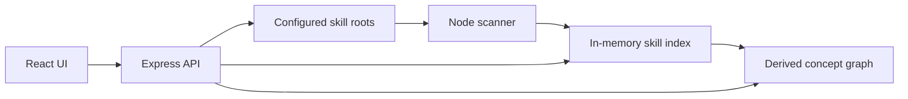

# SkillWeaver Architecture

SkillWeaver is a local-first scanner and navigator for Codex skills.

## Components

- `server/skill-scanner.js`: reads `SKILL.md` files and derives searchable metadata.
- `server/index.js`: exposes the local API and serves the production build.
- `src/`: React UI for search, filters, workflow recommendations, and inspection.
- `tests/`: Node test coverage for parsing, indexing, and ranking.

## Concept Layer

The scanner builds a concept graph above the raw skill graph. Concept nodes represent high-level agent work such as Figma handoff, frontend implementation, security review, GitHub PR repair, and data dashboards.

Each concept stores role-tagged references to skills:

- `gateway`: load or inspect first.
- `primary`: main skill for execution.
- `verification`: proof or QA skill.
- `supporting`: adjacent helper.
- `reference`: weaker evidence match.

Concept edges come from curated adjacency and shared skill/domain/tool evidence. This keeps SkillWeaver closer to MindWeaver's idea of interconnected knowledge while leaving `SKILL.md` files as the source artifacts.

## MindWeaver Ideas Kept

- local-first operation,
- explicit provenance,
- graph-like relationships,
- selected-node inspector,
- source-grounded answers.
- concept-level navigation.

## MindWeaver Ideas Removed

- browser extension,
- content ingestion queue,
- LLM classification as a requirement,
- sessions as learning maps,
- quizzes, spaced review, and gap analysis,
- backup/restore UI,
- multi-user/team roadmap.
