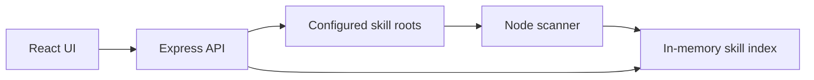

# SkillWeaver Architecture

SkillWeaver is a local-first scanner and navigator for Codex skills.

## Components

- `server/skill-scanner.js`: reads `SKILL.md` files and derives searchable metadata.
- `server/index.js`: exposes the local API and serves the production build.
- `src/`: React UI for search, filters, workflow recommendations, and inspection.
- `tests/`: Node test coverage for parsing, indexing, and ranking.

## MindWeaver Ideas Kept

- local-first operation,
- explicit provenance,
- graph-like relationships,
- selected-node inspector,
- source-grounded answers.

## MindWeaver Ideas Removed

- browser extension,
- content ingestion queue,
- LLM classification as a requirement,
- sessions as learning maps,
- quizzes, spaced review, and gap analysis,
- backup/restore UI,
- multi-user/team roadmap.

